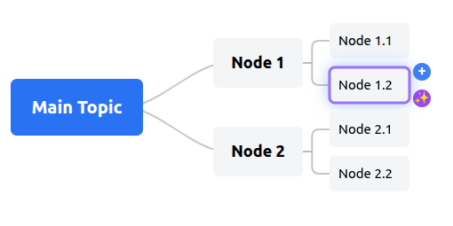

# openMindMap

A powerful Obsidian plugin (openMindMap) that automatically renders Markdown files as interactive D3.js mind maps.



## ⚡ Quick Start

Get started with openMindMap in 2 minutes:

### 1. Install the plugin

Search for "openMindMap" in **Obsidian Settings → Community plugins → Browse**, then click **Install** and **Enable**.

### 2. Create your first mind map (1 minute)

Create a new markdown file with this content:

```markdown
#mindmap

* My Project
    * Research
    * Planning
    * Development
```

### 3. Start using (1 minute)

- Save the file and watch it transform into an interactive mind map
- Click nodes to select, double-click to edit
- Use mouse wheel to zoom, drag to pan

**Need help?** See [Usage Guide](#usage-guide) for detailed instructions.

---

## 📋 Table of Contents

- [Quick Start](#quick-start)
- [Plugin Introduction](#plugin-introduction)
- [Core Features](#core-features)
- [Usage Guide](#usage-guide)
- [AI Features](#ai-function-usage-guide)
- [Interactive Operations](#interactive-operation-instructions)
- [Theme Adaptation](#theme-adaptation-instructions)
- [Configuration Options](#configuration-options)
- [Troubleshooting](#troubleshooting)
- [File Format Specification](#detailed-file-format-specification)
- [Technical Architecture](#technical-architecture)
- [License](#license)
- [Contributions](#contributions)
- [Support and Feedback](#support-and-feedback)
- [Version History](#version-history)

---

## 📖 Plugin Introduction

This plugin provides mind map visualization functionality for Obsidian. When you open a Markdown file that begins with `#mindmap`, the plugin automatically replaces the standard Markdown editor with an interactive D3.js tree mind map, making your knowledge structure more intuitive and easy to understand.

## ✨ Core Features

### 🎯 Automatic Detection and Conversion
- Automatically identifies Markdown files that begin with `#mindmap`
- Seamlessly replaces the Markdown editor with a mind map view
- Supports Markdown list syntax conversion to tree structure

### 🎨 Interactive D3.js Visualization
- Powerful rendering engine based on D3.js 7.x
- Smooth animation transition effects
- Responsive layout with automatic node position calculation
- Beautiful Bézier curve connectors

### 🖱️ Rich Interactive Operations
- **Node Editing**: Double-click nodes to edit content
- **Node Management**: Add, delete, copy nodes
- **Canvas Zoom**: Support mouse wheel zoom to view overall or detailed views
- **Canvas Panning**: Hold left mouse button to drag the canvas
- **Node Selection**: Highlight selected nodes and their paths

### 🎭 Perfect Theme Adaptation
- Automatically reads CSS variables from Obsidian's current theme
- Perfectly integrates with dark/light themes
- Automatically adapts node colors, text colors, and background colors
- Maintains consistency with the Obsidian interface

### 🤖 AI Smart Suggestions
- ✨ **AI-driven node content suggestions**: Intelligently analyzes node content to generate relevant suggestions
- 🔌 **Supports any OpenAI-compatible API**: Works with OpenAI, Anthropic, local models, etc.
- 🧠 **Context-aware**: Analyzes node hierarchy, parent nodes, sibling nodes, and existing content
- 🎯 **Flexible addition**: Click individual suggestions or add all at once
- 📝 **Fully customizable**: Customizable AI system prompts and prompt templates

### 🔒 Security and Privacy
- 🛡️ **AES-GCM 256-bit encryption** for API keys
- 🔐 **Device-specific key derivation** using PBKDF2
- 💾 **Local encrypted storage** in `data.json`
- 🔑 **Device-bound keys** - encrypted data cannot be decrypted on other devices

*See [AI Features - Security](#ai-security) for detailed security information.*

## 🚀 Usage Guide

### Creating Mind Map Files

1. Create a new Markdown file in Obsidian
2. The first line of the file must be `#mindmap` (note that there cannot be any spaces or other characters before it)
3. Write content using standard Markdown list syntax
4. Save the file

### File Format Example

```markdown
#mindmap

* Central Topic
    * Branch Topic 1
        * Subtopic 1.1
        * Subtopic 1.2
    * Branch Topic 2
        * Subtopic 2.1
            * Deeper Topic
        * Subtopic 2.2
```

### Indentation Rules

- Use **4 spaces** as the indentation unit (required)
- Each additional 4 spaces represents an additional parent-child relationship level
- Keep the same indentation for topics at the same level
- Tab key indentation is not supported (space indentation recommended)

### Complete Example

```markdown
#mindmap

* Project Management
    * Project Planning
        * Requirements Analysis
            * User Research
            * Competitor Analysis
        * Timeline Planning
            * Milestone Setting
            * Task Decomposition
    * Project Execution
        * Development Phase
            * Frontend Development
            * Backend Development
        * Testing Phase
            * Unit Testing
            * Integration Testing
    * Project Summary
        * Lessons Learned
        * Improvement Suggestions
```

## 🌐 Network Usage

This plugin uses network connections **only** for the optional AI-powered node suggestion feature:

- **Purpose**: Send node context to user-configured AI APIs to generate content suggestions
- **When**: Only when you click the AI suggestion button (✨) on a node
- **Services**: OpenAI-compatible APIs (user-configured - OpenAI, Anthropic, local models, etc.)
- **Data sent**: Node text, hierarchy context, parent/sibling/child nodes
- **Data storage**: API keys are encrypted with AES-256 and stored locally
- **Opt-out**: AI features are completely optional - the plugin works fully without them

**No other network requests are made. No telemetry, analytics, or data collection.**

## 🤖 AI Function Usage Guide

### Configure AI

1. Open Obsidian Settings → openMindMap Plugin Settings
2. Find the **"AI Configuration"** section
3. Fill in the following information:
   - **API Base URL**: Your API address
     - OpenAI Official: `https://api.openai.com/v1`
     - Anthropic: `https://api.anthropic.com/v1`
     - Other compatible services: Please check corresponding service documentation
   - **API Key**: Your API key (will be stored with AES-256 encryption)
   - **Model Name**: Model name
     - OpenAI: `gpt-3.5-turbo`, `gpt-4`, `gpt-4-turbo-preview`
     - Anthropic: `claude-3-sonnet`, `claude-3-opus`
     - Others: `llama2`, `mistral`, etc.
4. Click the **"Test Connection"** button to verify configuration (10-second timeout)
5. AI functionality can be used after successful testing

### Using AI Suggestions

1. **Select any node** in the mind map
2. Two buttons will appear to the right of the node:
   - ➕ **Blue Button**: Manually add child node (traditional method)
   - ✨ **Purple Button**: AI suggestion button
3. Click the ✨ button, and AI will analyze the node content and generate 3-5 related suggestions
4. In the suggestion panel:
   - **Click individual suggestion**: Add it as a child node (added items will be grayed out)
   - **Click "Add All"**: Add all suggestions at once
   - **Close panel**: Click outside area or close button
5. Continue selecting other nodes to get more suggestions

### Customize AI Prompts

The **"AI Prompt Configuration"** section allows complete customization of AI behavior:

#### System Message
Define the role and behavior of the AI assistant. For example:
```
You are a professional mind map assistant skilled at helping users expand and organize knowledge points. Please provide relevant child node suggestions based on the given node content.
```

#### Prompt Template
Customize the prompt template for suggestion generation, supporting the following variables:

| Variable | Description | Example |
|----------|-------------|---------|
| `{nodeText}` | Current node text | "Project Management" |
| `{level}` | Node level (0=root node) | 0, 1, 2... |
| `{parentContext}` | Parent node information | "Parent: Project Management" |
| `{siblingsContext}` | List of sibling nodes | "Related nodes: Project Planning, Project Execution" |
| `{existingChildren}` | Existing child nodes | "Existing children: Requirements Analysis" |
| `{centralTopic}` | Central topic (root node) | "Project Management" |

**Default Template Example**:
```
Please provide 3-5 related child node suggestions for the following node:

Node content: {nodeText}
Level: {level}
Central topic: {centralTopic}

{parentContext}{siblingsContext}{existingChildren}

Return only suggested child node content, one per line, without numbering or other formatting.
```

#### Reset Prompts
Click the **"Reset to Defaults"** button to restore default system message and prompt template.

### 🔒 Security Notice {#ai-security}

Your API key is protected with multiple layers of security:

- **AES-GCM 256-bit encryption**: Military-grade encryption for your API keys
- **PBKDF2 key derivation**: 100,000 iterations with SHA-256
- **Device-bound keys**: Encryption keys derived from device-specific information
- **No portable storage**: Encrypted data cannot be decrypted on other devices
- **Local storage only**: API keys never leave your device in unencrypted form

**Security Best Practices**:
- Rotate your API key regularly
- Use a dedicated API key for this plugin
- Never share your `data.json` file with others

## 🎯 Interactive Operation Instructions

### Node Operations

| Operation | Method | Effect |
|-----------|--------|--------|
| Select Node | Click node text | Highlight selected node and parent path |
| Edit Node | Double-click node text | Enter edit mode to modify content |
| View Node Details | Hover mouse | Highlight node and parent path |

### Canvas Operations

| Operation | Method | Effect |
|-----------|--------|--------|
| Zoom | Mouse wheel | Zoom in/out view |
| Pan | Left mouse button drag | Move canvas position |
| Reset | (Future feature) | Return to initial view |

### Quick Access

- **Command Palette**: `Ctrl+P` (Windows/Linux) or `Cmd+P` (Mac), type "Mind Map" for quick access
- **Ribbon Icon**: Click the mind map icon in the Obsidian right ribbon

## 🎨 Theme Adaptation Instructions

The plugin automatically reads your Obsidian theme colors, including:

- **Background Color**: Mind map canvas background
- **Text Color**: Node text color
- **Accent Color**: Selected nodes and highlight effects
- **Border Color**: Node borders and connector lines
- **Font**: Uses your theme's primary font

### Theme Variable Sources

The plugin reads colors from the following CSS variables:
- `--background-primary`
- `--text-normal`
- `--text-muted`
- `--interactive-accent`
- `--interactive-accent-hover`
- etc...

## ⚙️ Configuration Options

### Device Settings
- **Device Type**: Auto/Desktop/Mobile mode selection

### AI Configuration

For complete AI setup instructions, see [AI Features](#ai-function-usage-guide) above.

Quick access: **Settings → openMindMap Plugin Settings → AI Configuration**

### Future Plans
- Customizable node sizes
- Connector line style selection (straight/curved)
- Animation effect toggle
- Export format selection (SVG/PNG)

## 🐛 Troubleshooting

### Problem 1: File does not convert to mind map

**Possible causes**:
- First line of file is not `#mindmap`
- Spaces or other characters before `#mindmap`
- File encoding is not UTF-8

**Solutions**:
- Ensure the first line contains only `#mindmap`, with no spaces before or after
- Check file encoding, use UTF-8

### Problem 2: Mind map displays incorrectly

**Possible causes**:
- Incorrect Markdown list format
- Disorganized indentation levels
- Special characters not properly escaped

**Solutions**:
- Check list format, must start with `-`, `*`, `+`, or number + `.`
- Ensure consistent indentation, **use 4 spaces per level** (heading syntax # ## ### not supported)
- Verify first line contains only `#mindmap`, no spaces before or after
- Avoid using special Markdown symbols in node text

### Problem 3: Colors display incorrectly

**Possible causes**:
- Theme does not define standard CSS variables
- Theme compatibility issues

**Solutions**:
- Switch to default theme for testing
- Contact theme author to ensure CSS variable compatibility

### Problem 4: AI suggestion function unavailable

**Possible causes**:
- API key or API URL not configured
- Network connection issues
- API service unavailable
- Invalid or expired API key
- Incorrect model name
- Firewall or proxy settings blocking access

**Solutions**:
- Check AI configuration in plugin settings is complete
- Click "Test Connection" to test API connection
- Check API key is valid and has sufficient quota
- Confirm model name is correct (such as `gpt-3.5-turbo`)
- Check network connection and firewall settings
- View detailed error information in developer tools console (Ctrl+Shift+I)
- Try changing API address (such as using proxy or local service)

**Common error messages**:
- `401 Unauthorized`: Incorrect or invalid API key
- `404 Not Found`: Incorrect API address or model name
- `Timeout`: Network connection timeout, check network or proxy settings
- `500 Server Error`: API service temporarily unavailable, retry later

### Problem 5: Poor quality AI suggestions

**Possible causes**:
- System prompt not specific enough
- Node text not clear enough
- Model capability limitations
- Prompt template not optimized

**Solutions**:
- **Customize system prompt**: Define AI role more specifically in "AI System Message"
- **Optimize prompt template**: Adjust prompt format in "Prompt Template"
- **Use more powerful model**: Upgrade from `gpt-3.5-turbo` to `gpt-4`
- **Improve node text**: Use clearer, more specific node names
- **Provide context**: Ensure node has clear parent and sibling context
- **Adjust variable order**: Reorder variables in template for better results

**Prompt optimization examples**:

Optimize system prompt for different scenarios:
- **Study Notes**: "You are a professional teacher skilled at helping students organize knowledge structures and key points"
- **Project Management**: "You are a project management expert skilled at project decomposition and task planning"
- **Creative Writing**: "You are a creative writing consultant who can provide rich ideas and writing perspectives"

## 📝 Detailed File Format Specification

### ⚠️ Important Notice

**This plugin only supports Markdown list syntax, not heading syntax.**

Please use the following format:
- ✅ **Correct**: Use `*`, `-`, `+` as list markers, with 4-space indentation per level
- ❌ **Incorrect**: Use `#`, `##`, `###` heading syntax (will not be recognized as nodes)

### Supported Markdown List Syntax

```markdown
#mindmap

# Using hyphens (recommended)
- Top-level node
    - Second-level node
        - Third-level node
    - Another second-level node

# Or using plus signs
+ Top-level node
    + Second-level node

# Or using asterisks
* Top-level node
    * Second-level node
```

### Correct List Syntax Format

```markdown
#mindmap

* Top-level node (root node)
    * Second-level node (4-space indent)
        * Third-level node (8-space indent)
            * Fourth-level node (12-space indent)
```

**Note**:
- Each level must increase by 4 spaces
- You can use `*`, `-`, or `+` as list markers
- Keep indentation consistent for nodes at the same level

### Formatting Considerations

- **List syntax only**: Must use `*`, `-`, `+`, or numbered lists
- **Heading syntax not supported**: Markdown headings `#`, `##`, `###` etc. will not be recognized as nodes
- **Consistency**: Recommend using the same list marker in the same file (such as all using `*`)
- **Indentation requirement**: 4 spaces per level, Tab not supported

### Node Text Content

Node text can contain:
- **Plain text**: Chinese/English, numbers, symbols
- **Emoji expressions**: ✨ 🎯 📝
- **Basic formatting**: Bold, italic (partial support)

Not recommended to include:
- Links `[]()`
- Code `` ` ``
- Images ``
- Complex Markdown syntax

## 🔧 Technical Architecture

### Modular Design

Plugin uses modular service architecture:

- **MindMapPlugin**: Main plugin class, lifecycle management
- **MindMapService**: Central service layer, coordinating various modules
- **MindMapView**: Custom view class, state management
- **D3TreeRenderer**: D3.js rendering engine
- **D3FileHandler**: File handling and Markdown parsing
- **InteractionHandler**: User interaction handling
- **LayoutCalculator**: Layout calculation engine

### Technology Stack

- **TypeScript 5.9.3**: Type-safe development experience
- **D3.js 7.9.0**: Powerful data visualization library
- **Obsidian API**: Native plugin system integration
- **Esbuild**: Fast bundling and compilation

## 📄 License

MIT License

## 🤝 Contributions

Issue and Pull Request contributions welcome!

### Development Related

If you are a developer wanting to participate in development or modify the plugin, please check:
- `CLAUDE.md`: Detailed development documentation and architecture specifications
- `test/README.md`: Test architecture documentation
- Code comments: Source code contains detailed Chinese comments

## 📞 Support and Feedback

- **Issue Reporting**: Please submit in GitHub Issues
- **Feature Requests**: Welcome to share your ideas and suggestions
- **Usage Questions**: Please first check the "Troubleshooting" section of this document

## 🎉 Acknowledgments

### Third-Party Libraries

This plugin uses the following open-source libraries:

- **D3.js v7.9.0** (ISC License)
  - Copyright (c) 2010-2023 Mike Bostock
  - Used for interactive data visualization and rendering
  - Repository: https://github.com/d3/d3
  - License: https://github.com/d3/d3/blob/main/LICENSE

- **Obsidian API** (MIT License)
  - Official Obsidian plugin development kit
  - Used for plugin integration with Obsidian

### Special Thanks

- Thanks to the Obsidian team for providing a powerful note-taking platform
- Thanks to the D3.js community for excellent visualization tools
- Thanks to all users who use and provide feedback on the openMindMap plugin

## 📋 Version History

### v1.0.0 (Current Version)

**Main Features**:
- ✅ Automatic detection of `#mindmap` files
- ✅ D3.js interactive tree visualization
- ✅ Node editing and management features
- ✅ Canvas zoom and pan
- ✅ Automatic theme color adaptation
- ✅ State persistence
- ✅ Command palette integration
- ✅ Ribbon icon
- ✅ **🤖 AI intelligent node suggestions**
- ✅ **🔒 API key encrypted storage**
- ✅ **🎨 Customizable AI prompts**

**Technical Features**:
- ✅ Modular service architecture
- ✅ TypeScript type safety
- ✅ Complete error handling
- ✅ Detailed Chinese/English documentation
- ✅ **AES-256 encryption technology**
- ✅ **OpenAI-compatible API integration**
- ✅ **Mobile optimization**
- ✅ **Context-aware AI suggestions**

---

**Enjoy your mind mapping journey!** 🚀✨
